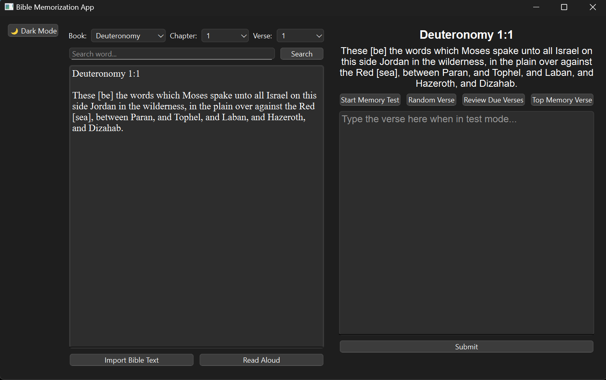

# 📖 Bible Memorization App



A Python-based desktop application to help you **memorize the Bible** verse by verse, chapter by chapter — using active recall, hints, and spaced repetition techniques.

---

## ✨ Features

- **Verse-by-Verse Memorization**: View Bible text on the left; take memory tests on the right.
- **Supports Multiple File Formats**: Load Bible text from `.pdf`, `.txt`, or `.sqlite` files.
- **Memory Test Mode**:
  - Bible text blurs out.
  - You get chapter and verse info with dashes to fill in.
  - Up to 5 tries per verse.
  - Get progressive hints after each mistake (e.g., first letters revealed).
- **Spaced Repetition**: Automatically brings back verses or chapters you've previously learned, based on how well you've memorized them.
- **Goal Setting**: Select Bible books, chapters, or individual verses to memorize.

---

## 🧠 How It Works

1. **Set Your Goal**:
   - Choose to memorize a Bible book (e.g. Jude), specific chapters, or custom verse sets.
   
2. **Study View**:
   - On the left: full Bible text displayed from your chosen file.
   - On the right: blank field for memory tests.

3. **Take Memory Test**:
   - Click the “Memory Test” button.
   - The left panel blurs.
   - The app shows verse number and dashes for the verse content.
   - Type your answer in the field on the right.
   - Get hints with every mistake (up to 5 tries).

4. **Feedback & Learning**:
   - Hints escalate gradually: first letter, second letter, etc.
   - If the verse is memorized correctly, it's saved to the review list.

5. **Spaced Repetition**:
   - Previously memorized verses are scheduled for future review automatically.

---

## 🛠 Technologies Used

| Purpose | Library |
|--------|--------|
| GUI | `PyQt5`, `Tkinter`, or `Kivy` |
| PDF Parsing | `PyPDF2` or `PyMuPDF` |
| SQLite Database | `sqlite3` |
| File Handling | Built-in Python file I/O |
| EXE Packaging | `PyInstaller` |

---

## 🚀 Getting Started

### 1. Clone the Repo

```bash
git clone https://github.com/Faadabu/Bible-Memorization-App.git
cd Bible-Memorization-App
